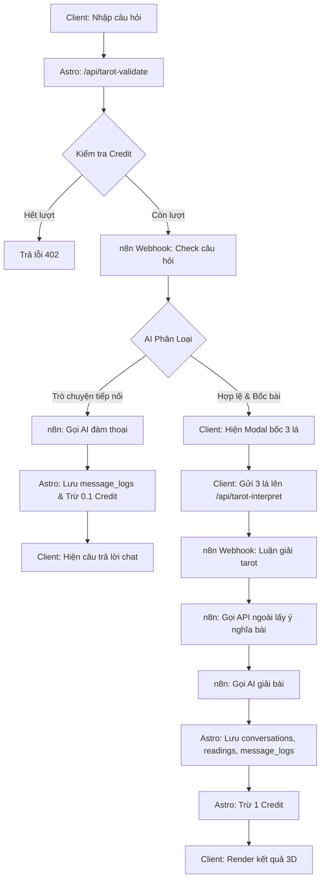

# 🔮 BÁO CÁO PHÂN TÍCH CHUYÊN SÂU & ĐÁNH GIÁ KỸ THUẬT: PHỞ GÕ TAROT

> **Ngày cập nhật**: 26/05/2026  
> **Phạm vi tập trung**: `/xem-tarot` logic, Auth System, Database D1, Cơ chế Cache, Dung lượng Code (Bloat), Monetization & Workflow `tarot.json`

---

## 📊 BẢNG ĐIỂM ĐÁNH GIÁ CHUYÊN SÂU

| # | Hạng mục cốt lõi | Điểm | Đánh giá kỹ thuật |
|---|------------------|------|-------------------|
| 1 | 🔮 Logic Trải bài `/xem-tarot` & Workflow n8n | **5.5**/10 | ⚠️ Có cấu trúc tốt nhưng dư thừa tài nguyên và thiếu tối ưu |
| 2 | 🔒 Hệ thống Đăng nhập & Xác thực (Auth) | **4.0**/10 | 🔴 Bảo mật yếu, nhiều kẽ hở lớn |
| 3 | 💾 Lưu trữ Database D1 (Persistence) | **5.0**/10 | ⚠️ Triển khai nửa vời, chưa đồng bộ các trang |
| 4 | ⚡ Cơ chế Cache (Client & Server) | **4.5**/10 | ⚠️ Phụ thuộc quá nhiều vào localStorage và API ngoài |
| 5 | 📦 Dung lượng Code & Code Bloat | **3.5**/10 | 🔴 Trùng lặp mã nguồn nghiêm trọng, khó bảo trì |
| 6 | 💰 Hệ thống Monetization (Credit & Webhook) | **3.0**/10 | 🔴 Lỗ hổng thất thoát tài chính nghiêm trọng |

### 🏆 ĐIỂM ĐÁNH GIÁ CHUNG: **4.2 / 10** — *Mức Prototype hoạt động tốt nhưng chưa đủ an toàn và tối ưu để thương mại hóa.*

---

## 1. 🔮 LOGIC TRẢI BÀI `/xem-tarot` & WORKFLOW n8n (`tarot.json`)

### Luồng vận hành (Workflow) hiện tại:
1. **Validate**: Client gửi câu hỏi -> `/api/tarot-validate` -> Gọi n8n Webhook "Check câu hỏi" -> AI trả về `isValid` và `pick_card`.
2. **Draw**: Nếu cần bốc bài, client hiển thị Modal bốc bài -> Người dùng chọn 3 lá -> Client gửi 3 lá bài lên `/api/tarot-interpret` -> Gọi n8n Webhook "Luận giải tarot".
3. **Interpret**: n8n gọi API ngoài tra cứu ý nghĩa bài -> Gọi LLM -> Trả kết quả luận giải về client hiển thị và lưu DB D1.
4. **Chat/Conversational**: Nếu là câu hỏi đàm thoại tiếp nối, n8n tự động trả lời thông qua webhook validation mà không cần bốc bài lại.



### 🔴 Điểm yếu & Sự dư thừa Kỹ thuật:
*   **Dư thừa truy vấn & Gọi API ngoài lãng phí**: 
    Trong file `tarot-interpret.ts` (dòng 70-83), Astro API đã truy vấn database cục bộ D1 (`tarot_database`) để lấy ý nghĩa lá bài và truyền sang n8n dưới dạng `body.cards[i].meaning`.  
    Tuy nhiên, trong file workflow `tarot.json` (dòng 160-174), n8n lại thực hiện thêm một HTTP Request nữa đến `https://phogotarot-api.tuanphan1112-working.workers.dev/cards/query` để tra cứu lại ý nghĩa lá bài.
    > [!IMPORTANT]
    > Đây là sự dư thừa nghiêm trọng, làm chậm thời gian phản hồi của chatbot thêm 1-2 giây và tạo ra một điểm nghẽn (Single Point of Failure) nếu worker API ngoài bị sập. n8n nên dùng trực tiếp ý nghĩa bài đã được Astro đính kèm trong payload.

*   **Lỗ hổng Race Condition khi trừ Credit**:
    Cả hai API `/api/tarot-validate` và `/api/tarot-interpret` đều thực hiện việc kiểm tra credit ở đầu hàm (SELECT số dư), sau đó thực hiện gọi webhook n8n (mất khoảng 3-8 giây để AI sinh nội dung), rồi mới thực hiện UPDATE trừ số dư trong DB sau khi nhận kết quả.
    > [!CAUTION]
    > Kẻ xấu có thể mở nhiều tab hoặc viết script gửi 5-10 request cùng một thời điểm. Hệ thống sẽ SELECT thấy số dư ban đầu đều hợp lệ (ví dụ: còn 1 lượt), cho phép tất cả các luồng chạy AI và cuối cùng trừ tài khoản của người dùng về giá trị âm, hoặc cho phép họ dùng miễn phí hàng chục lượt mà không bị chặn ở đầu vào.

---

## 2. 🔒 HỆ THỐNG ĐĂNG NHẬP & XÁC THỰC (AUTH SYSTEM)

### 🔴 Điểm yếu bảo mật nghiêm trọng:
*   **Mật mã hóa mật khẩu cực kỳ yếu (`src/lib/auth.ts:94-101`)**:
    Hệ thống sử dụng thuật toán **SHA-256** với một salt tĩnh ghi cứng ngay trong code (`'phogo_tarot_secret_salt_2026'`) để băm mật khẩu người dùng.
    > [!CAUTION]
    > SHA-256 được thiết kế để tính toán cực nhanh, điều này khiến nó rất dễ bị bẻ khóa bằng kỹ thuật brute-force (thử sai hàng loạt) trên GPU thông dụng nếu database bị rò rỉ. Hơn nữa, việc lưu salt tĩnh trong code khiến toàn bộ mật khẩu của hệ thống bị đe dọa trực tiếp nếu lộ mã nguồn.
    > **Khắc phục**: Chuyển sang sử dụng PBKDF2 với số vòng lặp tối thiểu 100,000 lượt (Web Crypto API hỗ trợ sẵn trên Cloudflare Workers) hoặc bcrypt/scrypt. Salt phải được sinh ngẫu nhiên cho từng tài khoản và lưu trong database.

*   **OAuth Google thiếu cơ chế bảo mật chống CSRF**:
    Trong luồng đăng nhập mạng xã hội, token OAuth được truyền trực tiếp từ client lên `/api/auth/sync` mà không có tham số `state` để kiểm tra tính hợp lệ của request khởi tạo ban đầu. Điều này khiến luồng OAuth dễ bị tấn công giả mạo yêu cầu chéo trang (CSRF).

*   **Không hủy bỏ session cũ khi đổi mật khẩu (`reset-password.ts`)**:
    Khi người dùng thực hiện reset mật khẩu hoặc đổi mật khẩu thành công, hệ thống chỉ cập nhật trường mật khẩu trong bảng `users` mà **không hề xóa các session cũ đang hoạt động** của user đó trong bảng `sessions`. Kẻ tấn công nếu đang giữ session token cũ vẫn có thể tiếp tục truy cập trái phép bình thường.

---

## 3. 💾 LƯU TRỮ DATABASE D1 (PERSISTENCE)

### 🔴 Điểm yếu & Sự thiếu đồng bộ:
*   **Triển khai lưu trữ nửa vời**:
    Database D1 đã được thiết kế rất bài bản với đầy đủ các bảng lịch sử: `conversations` (lưu phiên chat), `tarot_readings` (lưu thông tin trải bài, vị trí 3 lá), và `message_logs` (lưu chi tiết lịch sử tin nhắn của user và AI).  
    Tuy nhiên, **chỉ có trang `/xem-tarot` mới thực hiện lưu lịch sử vào DB**. Hai trang trải bài còn lại là `tarot.astro` (Trải bài 3 lá truyền thống) và `yes-no-reading.astro` (Yes/No) hoàn toàn bỏ qua DB, chỉ hoạt động tạm thời trên client và sẽ mất toàn bộ lịch sử khi F5 hoặc tắt trình duyệt.

*   **Sử dụng Drizzle ORM không nhất quán**:
    Mã nguồn có file `src/db/schema.ts` định nghĩa toàn bộ schema dạng Drizzle ORM cực kỳ chuyên nghiệp và chuẩn chỉ. Nhưng trong tất cả các API routes (`tarot-interpret.ts`, `tarot-validate.ts`, `auth/sync.ts`...), hệ thống lại viết **câu lệnh SQL thuần dạng chuỗi (`db.prepare().bind()`)**.
    > [!WARNING]
    > Việc này làm mất đi hoàn toàn lợi ích của Type-safety từ Drizzle ORM, làm code trở nên lộn xộn, khó debug lỗi cú pháp SQL tại thời điểm biên dịch (compile-time) và tạo ra sự dư thừa mã nguồn (Drizzle schema trở thành dead-code không dùng đến).

*   **Lỗ hổng phân quyền Guest User**:
    Trong `tarot-validate.ts` và `tarot-interpret.ts`, khi không có user đăng nhập, hệ thống sử dụng ID guest từ client gửi lên (`body.userId`). Nếu client gửi lên một ID của một user thật đã đăng nhập, Guest có thể đọc được thông tin profile cá nhân hóa của user đó hoặc thao túng số dư ví của họ.

---

## 4. ⚡ CƠ CHẾ CACHE (CLIENT & SERVER)

### 🔴 Điểm yếu trong cơ chế lưu trữ tạm thời:
*   **Lưu lịch sử chat bằng `localStorage` không an toàn**:
    Trang `/xem-tarot` lưu toàn bộ lịch sử đàm thoại trực tiếp dưới dạng JSON trong `localStorage` với key `phogo_tarot_chat_page_history` để render nhanh.
    > [!WARNING]
    > 1. Trình duyệt giới hạn dung lượng `localStorage` ở mức 5MB. Nếu lịch sử quá dài hoặc chứa nhiều tin nhắn AI dài, nó sẽ gây lỗi tràn bộ nhớ client.
    > 2. Việc đọc JSON từ `localStorage` rồi gán thẳng vào DOM qua `innerHTML` trong file `xem-tarot.astro` mà không qua bước làm sạch dữ liệu (Sanitization) mở ra lỗ hổng **XSS**, cho phép kẻ xấu tiêm mã độc vào localStorage để chiếm đoạt tài khoản.

*   **Thiếu cơ chế Cache Server-side cho API bên ngoài**:
    Trang `zodiac-daily.astro` (Tử vi hàng ngày) tải dữ liệu tử vi từ Google Sheets thông qua JSONP mỗi khi có người dùng truy cập. Dữ liệu này chỉ thay đổi 1 lần mỗi ngày, nhưng hệ thống bắt mọi client phải tải trực tiếp từ Google Sheets, gây ra độ trễ cao và phụ thuộc hoàn toàn vào tính ổn định của Google API.
    > **Giải pháp**: Nên cache kết quả tử vi hàng ngày trên server (sử dụng Cloudflare KV hoặc D1) trong vòng 24 giờ.

---

## 5. 📦 DUNG LƯỢNG CODE & CƠ CHẾ BLOAT MÃ NGUỒN

### 🔴 Khủng hoảng dung lượng file do nhúng inline:
```
xem-tarot.astro      → 83KB (Chứa ~900 dòng JS và ~500 dòng CSS inline)
yes-no-reading.astro → 74KB (Bị nhân bản từ xem-tarot.astro)
tarot.astro          → 61KB (Bị nhân bản từ xem-tarot.astro)
----------------------------------------------------------------------
TỔNG CỘNG            → ~218KB code, trong đó hơn 65% là trùng lặp hoàn toàn!
```

> [!IMPORTANT]
> Đây là vấn đề nghiêm trọng nhất về mặt kiến trúc frontend. 
> Toàn bộ logic điều khiển DOM, hiệu ứng xáo bài (shuffle), bay bài (flight animation), lật bài 3D, giao diện bong bóng chat, xử lý gọi API... đều được **sao chép nguyên văn bằng cách copy-paste** ở cả 3 file trang trên.
>
> **Hậu quả**:
> 1. Khiến trang tải cực kỳ chậm trên thiết bị di động do trình duyệt phải parse hàng ngàn dòng Javascript inline không thể phân tách hay nén (code-splitting).
> 2. Không thể bảo trì: Nếu bạn muốn thay đổi giao diện bong bóng chat hoặc sửa một lỗi logic bốc bài, bạn sẽ phải thực hiện sửa thủ công ở cả 3 file trang khác nhau. Điều này chắc chắn sẽ dẫn đến việc sai lệch phiên bản và phát sinh lỗi mới.

---

## 6. 💰 HỆ THỐNG MONETIZATION & CỔNG THANH TOÁN (VIETQR WEBHOOK)

### 🔴 Lỗ hổng bảo mật P0 gây thất thoát tài chính trực tiếp:
*   **Webhook nhận tiền không hề có xác thực (`payment/webhook.ts`)**:
    Để cập nhật số dư credit hoặc trạng thái gói Premium khi người dùng chuyển khoản ngân hàng thành công, hệ thống cung cấp một API webhook `/api/payment/webhook`.
    > [!CAUTION]
    > **Đoạn code xác thực chữ ký bảo mật hoặc webhook secret trong file này hiện đang bị COMMENT LẠI hoàn toàn.**
    > Điều này có nghĩa là bất kỳ ai cũng có thể giả mạo một request POST chứa mã giao dịch ngẫu nhiên và số tiền lớn gửi trực tiếp tới endpoint này để hệ thống tự động cộng hàng ngàn credit hoặc kích hoạt Premium trọn đời mà không cần chuyển khoản 1 đồng nào.

*   **Thiếu cơ chế chống trùng lặp giao dịch (Idempotency)**:
    API xử lý webhook thanh toán không lưu lại lịch sử các mã giao dịch ngân hàng đã xử lý thành công vào một bảng duy nhất có thiết lập khóa chính (Unique Key). Một request webhook bị gửi lặp lại (do lỗi mạng hoặc cố ý tấn công) sẽ khiến hệ thống cộng credit nhiều lần cho cùng một giao dịch chuyển tiền duy nhất.

---

## 🛠️ LỘ TRÌNH KHẮC PHỤC KỸ THUẬT (ACTION PLAN)

### 1. Vá lỗ hổng Webhook thanh toán (Ưu tiên số 1 - Khẩn cấp)
*   Mở lại đoạn code kiểm tra `WEBHOOK_SECRET` trong file `src/pages/api/payment/webhook.ts`. Sử dụng biến môi trường bảo mật của Cloudflare để lưu trữ mã này.
*   Thiết lập Unique Constraint cho trường `transaction_code` (hoặc mã tham chiếu ngân hàng) trong database để ngăn chặn việc gọi webhook trùng lặp cộng tiền 2 lần.

### 2. Tái cấu trúc (Refactor) code Bloat & Trùng lặp (Ưu tiên số 2)
*   Trích xuất toàn bộ giao diện bong bóng chat, hiệu ứng gõ chữ, tự động cuộn vào component **`OracleChat.astro`** đã có sẵn.
*   Tạo mới một component dùng chung **`TarotSpreadModal.astro`** chứa toàn bộ hiệu ứng xáo bài, trải bài, bay bài 3D và sự kiện chọn bài.
*   Khi đó, 3 file trang `xem-tarot.astro`, `tarot.astro`, và `yes-no-reading.astro` sẽ được rút gọn chỉ còn dưới **5-10KB** mỗi file, đóng vai trò là các trang wrapper truyền prop cấu hình (ví dụ: `readingType="yes-no"` hoặc `readingType="standard"`).

### 3. Sửa lỗi bảo mật hệ thống Auth & Credit (Ưu tiên số 3)
*   **Password Hash**: Sử dụng Web Crypto API kết hợp với thuật toán **PBKDF2-HMAC-SHA256** với 100,000 lượt băm và sinh salt ngẫu nhiên cho mỗi user.
*   **Race Condition**: Trong file `tarot-interpret.ts`, hãy chuyển lệnh trừ credit thành một câu lệnh duy nhất kiểm tra điều kiện ngay khi update: 
    ```sql
    UPDATE credit_wallets SET balance = balance - 1 WHERE user_id = ? AND balance > 0;
    ```
    Nếu số dòng ảnh hưởng (affected rows) trả về là 0, lập tức từ chối và trả lỗi 402, tránh việc kiểm tra riêng lẻ dễ bị bypass bằng request đồng thời.

### 4. Đồng bộ Drizzle ORM
*   Chuyển toàn bộ các câu lệnh SQL viết bằng chuỗi thô trong các API sang dạng truy vấn Drizzle ORM chuẩn chỉnh (ví dụ: `db.select().from(users)...`). Điều này giúp mã nguồn đồng nhất, sạch sẽ và an toàn tuyệt đối trước các nguy cơ lỗi cú pháp.
